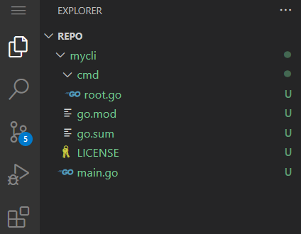

# Build a CLI in Go using Cobra

Building command-line interfaces is a foundational skill for developer tooling. Cobra powers some of the most widely-used CLIs in the ecosystem—Kubernetes, Hugo, GitHub CLI—and understanding its patterns will let you build professional-grade tools quickly.

## Prerequisites

Before you begin, make sure you have:

- Go 1.21+ installed (`go version` to check)
- A code editor with Go support (VS Code with Go extension recommended)
- Basic familiarity with Go syntax (structs, functions, packages)
- Terminal/command line proficiency

## Overview of the Process

1. Initialize a Go module and install Cobra
2. Create the root command structure
3. Add subcommands with flags and arguments
4. Handle input validation and errors gracefully
5. Build and test your CLI

## Step-by-Step Instructions

Step 0: Systems check

Do you have Go installed

```bash
go version
```
> note
> if go isn't installed, Visit golang.org for installation instructions and the Tour of Go for a quick introduction to the language.

### Step 1: Initialize Your Project

**What to do:**

```bash
mkdir mycli && cd mycli
go mod init github.com/yourusername/mycli
go install github.com/spf13/cobra-cli@latest
cobra-cli --help 
cobra-cli init

```

"cobra-cli --help" is to check if installed and PATH setup correctly

**Why it matters:** The `cobra-cli` scaffolding tool generates the conventional file structure that all major Cobra projects follow. Starting with this structure means your CLI will be maintainable and familiar to other Go developers.

**Expected result:** 

You should see a `cmd/` directory with `root.go` inside, plus a `main.go` at the project root.


---

### Step 2: Understand the Root Command

**What to do:** Open `cmd/root.go` and examine its structure:

```bash
//...existing code...
var rootCmd = &cobra.Command{
    Use:   "mycli",
    Short: "A brief description of your CLI",
    Long: `A longer description that spans multiple lines
and provides more context about your tool.`,
}

func Execute() {
    err := rootCmd.Execute()
    if err != nil {
        os.Exit(1)
    }
}
//...existing code...

```

**Why it matters:** The root command is the entry point. Every subcommand attaches to it. The `Use` field defines how users invoke your tool; `Short` appears in help listings; `Long` appears when users run `mycli --help`.

**Expected result:** Running `go run main.go` should display your CLI's help text.

---

### Step 3: Add a Subcommand

**What to do:**

```bash
cobra-cli add greet
```

This creates `cmd/greet.go`. Modify it:

```go
var greetCmd = &cobra.Command{
    Use:   "greet [name]",
    Short: "Greet someone by name",
    Args:  cobra.ExactArgs(1),
    Run: func(cmd *cobra.Command, args []string) {
        name := args[0]
        fmt.Printf("Hello, %s!\n", name)
    },
}

func init() {
    rootCmd.AddCommand(greetCmd)
}

```

**Why it matters:** Subcommands create the `git`-style interface users expect: `mycli greet`, `mycli build`, `mycli deploy`. The `Args` field validates input before `Run` executes.

**Expected result:**`go run main.go greet World` outputs `Hello, World!`

---

### Step 4: Add Flags

**What to do:** Enhance your greet command with flags:

```go
package cmd
import (
 "fmt"
 "github.com/spf13/cobra"
 "strings" // add this one for strings.ToUpper
)

var (
    uppercase bool
    times     int
)

var greetCmd = &cobra.Command{
    Use:   "greet [name]",
    Short: "Greet someone by name",
    Args:  cobra.ExactArgs(1),
    Run: func(cmd *cobra.Command, args []string) {
        name := args[0]
        if uppercase {
            name = strings.ToUpper(name)
        }
        for i := 0; i < times; i++ {
            fmt.Printf("Hello, %s!\n", name)
        }
    },
}

func init() {
    rootCmd.AddCommand(greetCmd)
    greetCmd.Flags().BoolVarP(&uppercase, "uppercase", "u", false, "Print name in uppercase")
    greetCmd.Flags().IntVarP(&times, "times", "t", 1, "Number of times to greet")
}

```

**Why it matters:** Flags modify behavior without changing the command structure. `BoolVarP` and `IntVarP` bind flag values directly to variables. The `P` suffix adds a short-form (`-u` vs `--uppercase`).

**Expected result:**`go run main.go greet -u -t 3 james` outputs `HELLO, JAMES!` three times.

---

### Step 5: Add Persistent Flags

**What to do:** In `root.go`, add a verbose flag available to all commands:

```go
var verbose bool

func init() {
    rootCmd.PersistentFlags().BoolVarP(&verbose, "verbose", "v", false, "Enable verbose output")
}

```

Then use it in any subcommand:

```go
Run: func(cmd *cobra.Command, args []string) {
    if verbose {
        fmt.Println("Verbose mode enabled")
    }
    *// ... rest of logic*
}

```

**Why it matters:** Persistent flags propagate to all subcommands. Use them for cross-cutting concerns like verbosity, config file paths, or output format.

Expected behavior:

- `-verbose` prints an extra line before the greeting
- Flags still work on subcommands

You can test this work by:

```bash
go run main.go greet World
go run main.go greet --verbose World
go run main.go greet -v -u -t 2 World
```

You can see all flags and Go's excellent built in documentation by giving `go run main.go greet --help`.  You should see something like:

```bash
Greet someone by name

Usage:
  mycli greet [name] [flags]

Flags:
  -h, --help        help for greet
  -t, --times int   Number of times to greet (default 1)
  -u, --uppercase   Print name in uppercase

Global Flags:
  -v, --verbose   Enable verbose output

```
---

### Step 6: Build Your Binary

**What to do:**

make sure you are in the directory with main.go

```bash
go build -o mycli .
./mycli greet -u World

```

**Why this matters:** Building the binary turns your Go code into an executable program. This is what allows the CLI to run without `go run`, be placed on your `PATH`, shared with others, and used like any system command.

**Expected result:** A standalone binary you can distribute and run anywhere Go supports.  Try the help command `./mycli greet --help` and experiment with different combinations of flags. 

---

## You'll Know You're Successful When

- The command `./mycli --help` displays your root command description and lists subcommands
- Running `./mycli greet --help` shows the greet command with its flags documented
- Your CLI validates arguments (try `./mycli greet` with no args—it should error helpfully)
- Flags modify behavior as expected
- You can build a portable binary

## Common Issues and Solutions

### Issue: "cobra-cli: command not found"

**Why it happens:** Go binaries install to `$GOPATH/bin`, which may not be in your PATH.

**How to fix it:** Add `export PATH=$PATH:$(go env GOPATH)/bin` to your shell profile.

### Issue: Flags not being recognized

**Why it happens:** Flags must be registered in `init()`, which runs before `Execute()`.

**How to fix it:** Ensure all `Flags()` calls are inside `init()` functions.

### Issue: Arguments and flags getting confused

**Why it happens:** Flags with values must use `=` or space correctly. 

**How to fix it:** Use `--times=3` or `--times 3`, not `--times3`.

## Tips from Experience

💡 **Use cobra-cli for scaffolding, then customize**: The generated code is a starting point. Real CLIs need custom error handling, configuration loading, and testing.

💡 **Group related flags**: If you have many flags, use `MarkFlagRequired()` for mandatory ones and consider flag groups for complex commands.

💡 **Add shell completion**: Cobra has built-in completion generation. Add `cobra-cli add completion` and users get tab-completion for free.

## Practice This Capability

1. **Add a `` subcommand** that says goodbye, with a `formal` flag that changes "Bye" to "Farewell"
2. **Add a `` subcommand** with nested `config get` and `config set` commands
3. **Add input validation** that rejects names shorter than 2 characters with a helpful error

## What You've Built

You now have the foundation to build any CLI tool in Go. The Cobra patterns you've learned—root commands, subcommands, flags, argument validation—scale from simple utilities to complex tools like `kubectl`.

## Next Steps

- Explore [Cobra documentation](https://cobra.dev/) for advanced features like PreRun hooks and custom validators
- Explore real-world Cobra CLIs on GitHub by searching for `cmd/root.go` and `cobra.Command`.
- Consider adding [Viper](https://github.com/spf13/viper) for configuration file support